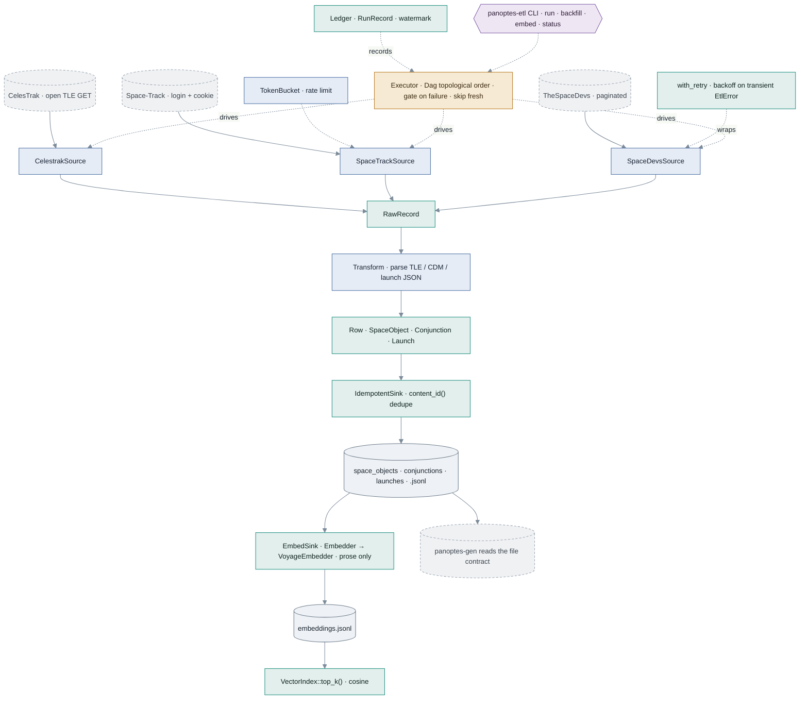
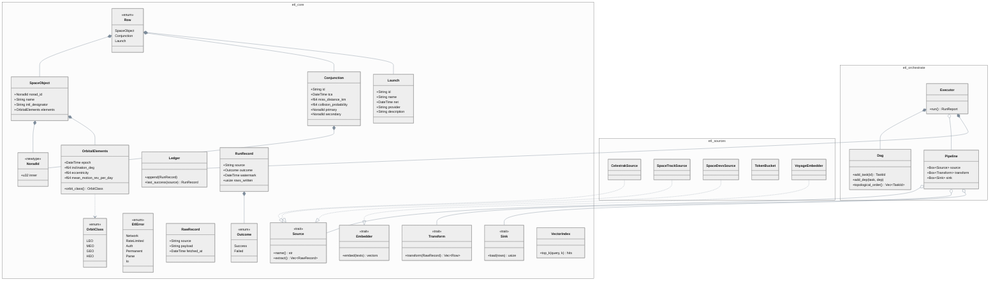

# The Architecture at a Glance

How the structs, enums, traits, and functions of the finished `panoptes_etl` connect. Four crates, built in dependency order — the arrow always points at `etl-core`:

`etl-sources` → `etl-orchestrate` → `panoptes-etl`, and all three → `etl-core`. `etl-orchestrate` depends on `etl-core` **only**: it schedules `dyn Source` and never names a concrete source, which is what lets your NASA capstone drop into the DAG with zero executor changes.

## The pipeline

Each source extracts raw bytes, a transform parses them into typed `Row`s, and an idempotent sink appends JSONL that `panoptes-gen` reads. The `Executor` runs the pipelines in dependency order — retrying transient failures, gating on upstream failure, skipping sources still fresh — and the retrieval arc embeds the prose fields into a vector index.

*Teal = `etl-core` · slate = `etl-sources` · amber = `etl-orchestrate` · plum = `panoptes-etl` · cylinders = files · dashed = external API or downstream.*

## Type relationships

The E/T/L trait triad — `Source`, `Transform`, `Sink` — is the spine. Concrete sources implement `Source`; the domain types are the payload of the `Row` enum the sink writes; and `Pipeline`/`Executor` compose the traits as boxed trait objects, which is what lets the orchestrator stay ignorant of any concrete source. The keystone is `Conjunction` — a real conjunction data message is the ground truth of a `ca_geo` collision-avoidance vignette.

*`*--` composition · `o--` aggregation (boxed trait object) · `..|>` implements · `«enum»`/`«trait»`/`«newtype»` stereotypes · `~T~` = generic parameter.*

## Per-crate inventory

| Crate | Owns | Key types |
|---|---|---|
| **etl-core** | The seams — domain model + E/T/L traits | `OrbitClass` · `EtlError` · `Row` · `Outcome` (enums); `NoradId`; `SpaceObject` · `OrbitalElements`; `Conjunction` (keystone) · `Launch`; `Source` · `Transform` · `Sink` · `Embedder` (traits); `Ledger` · `JsonlSink` · `IdempotentSink` · `VectorIndex`; `with_retry` · `content_id` · `cosine` |
| **etl-sources** | Concrete sources + the machinery each API forces | `parse_tle`; `CelestrakSource` · `SpaceTrackSource` (+ `Credentials`) · `SpaceDevsSource`; `TokenBucket`; `classify_status`; `VoyageEmbedder` |
| **etl-orchestrate** | The DAG executor (depends on `etl-core` only) | `Dag` · `TaskId`; `topological_order`; `Pipeline`; `Executor` · `RunReport` |
| **panoptes-etl** | The binary — the only crate that names concrete sources | `Cli` · `Command` (`run` / `backfill` / `embed` / `status`); `build_executor`; *NASA source = your capstone* |

The full, verified code behind every box is in the [Answer Key](./appendix-answer-key.md).
